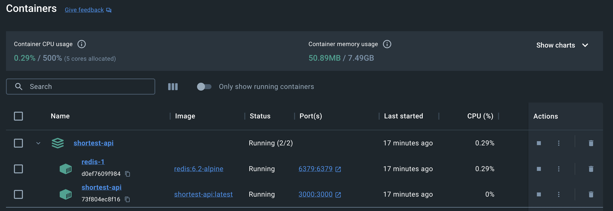

# SHORT.EST NODE API

ShortLink is a URL shortening service where you enter a URL such as https://indicina.co and itreturns a short URL such as http://short.est/GeAi9K. Visiting the shortened URL should redirectthe user to the long URL. Using the example above, visiting http://short.est/GeAi9K should redirect the user to https://indicina.co

[Link to API Documentation](https://documenter.getpostman.com/view/5574767/2s9YJgSzVX)

## Prerequisites
* The application depends on Redis for in-memory caching
* Install Docker Desktop if you currently don't have on your PC
* Start the Docker Desktop application

## How to run the application in DEVELOPMENT MODE

* Start the Docker Desktop application to ensure docker is running on local

* Navigate to the project root

* Startup the redis container with the command below

```
docker compose up -f docker-compose-redis-only.yml
```

* Install project dependencies

```
npm install
```

* Finally use the command below to startup the application in dev mode

```
npm run dev
```

* Then visit http://localhost:3000 on your Rest client e.g PostMan to access API


## How to run the application in DEVELOPMENT MODE

* Build the docker image for the app

```
docker build -t shortest-api:latest . 
```

* Run the docker compose in detached mode

```
docker compose up -d
```

 